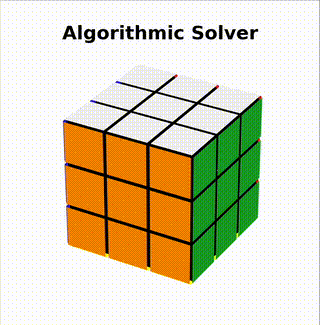

# RubiksCubeSolver

This project explores two distinct approaches to solving the Rubik's Cube:

1. **Algorithmic Solver**: 
   - Solves the cube piece by piece using logic and predefined algorithms.

2. **Classification Solver**:
   - Utilizes a deep neural network to predict the next best move based on the current cube state.
   - Iteratively applies these predicted moves to solve the cube, updating the state after each move.

## Usage

### Visual Demonstration



To compare the performance of the two solvers, run the `main.py` script:
```bash
python main.py
```
This will display a visual demonstration like the one above of a 3D Rubik's Cube being solved by both approaches on the same random scramble, highlighting the stark difference in move counts. The animations are created entirely using Matplotlib.

### Benchmarking
The benchmark.py script provides additional insights into solver performance. To customize the benchmarking process:

Open benchmark.py.
Comment or uncomment the desired lines under the if __name__ == "__main__": block.
Run the script:
```bash
python benchmark.py
```
